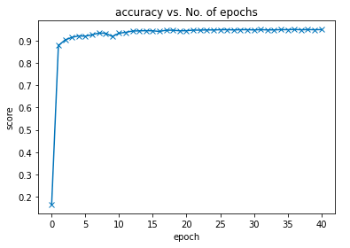
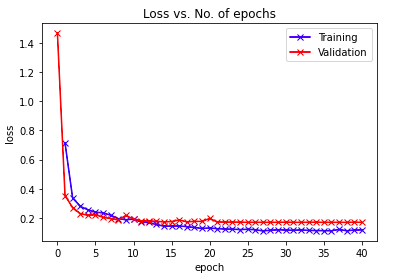
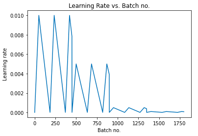
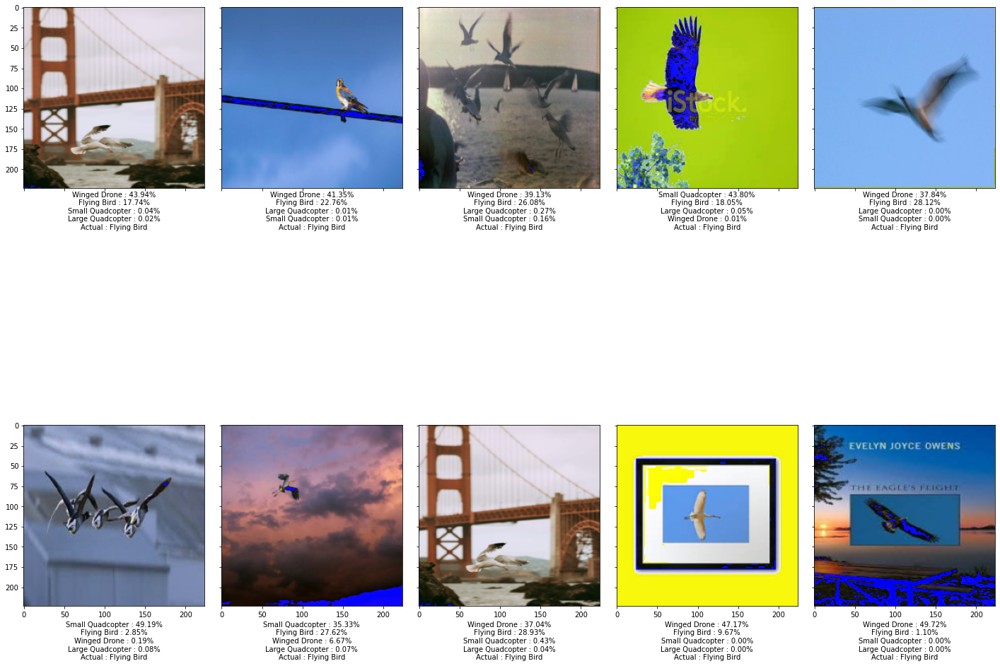
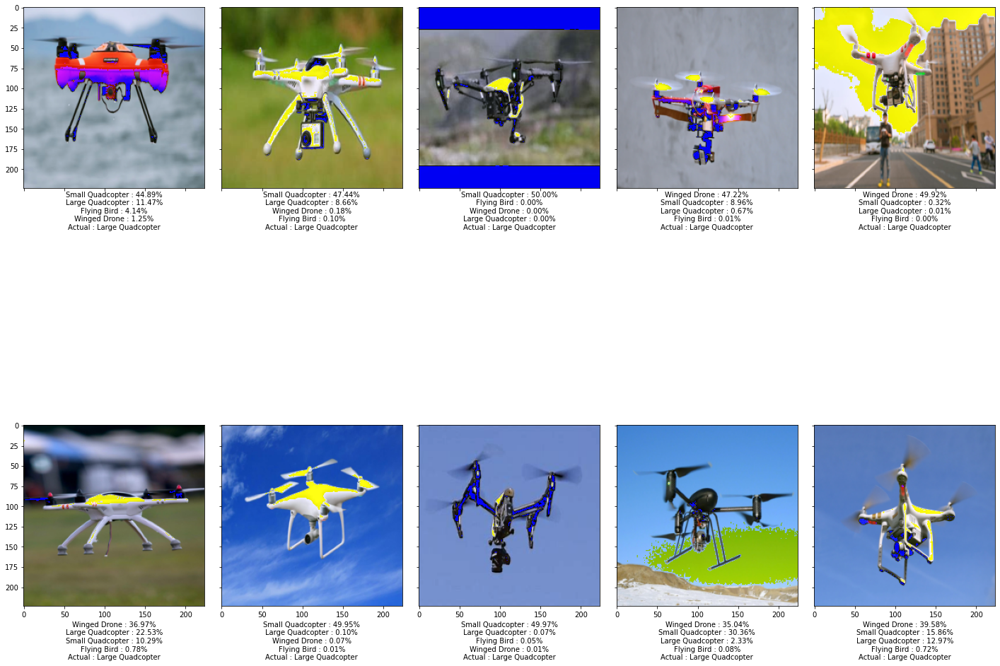
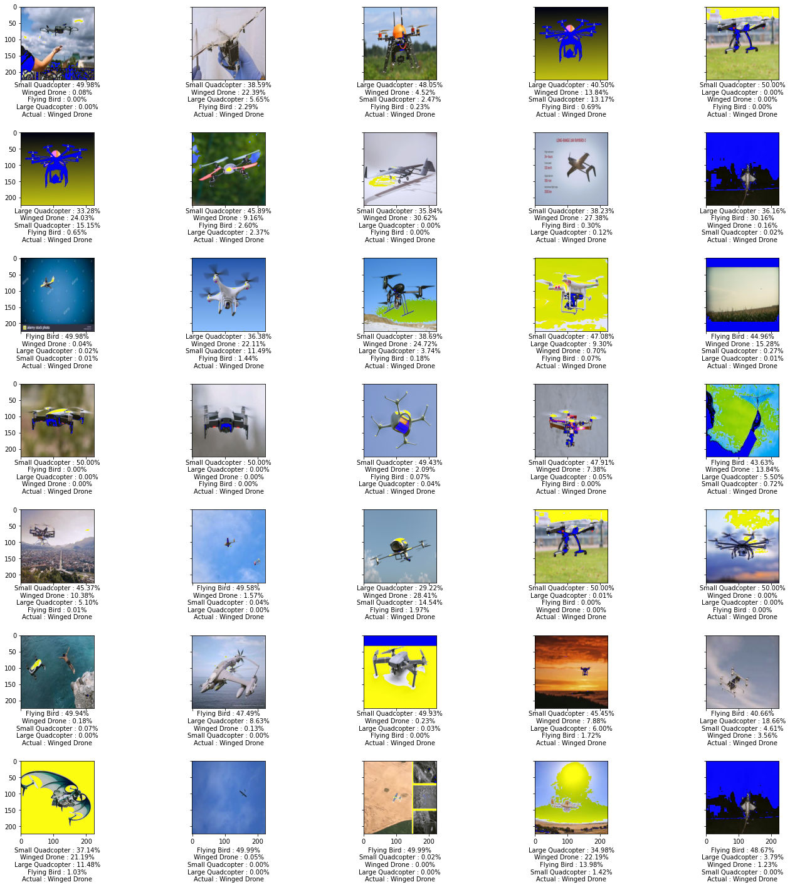

# Drone Classification Using MobilenetV2 [End to End]

In this project we are doing end to end deploying of MobilenetV2 model for custom drone dataset consists of four classes - ***Flying Birds, Large Quadcopters, Small Qualdcopters and Winged Drones***. 

The project steps includes ***drone dataset preparations***, ***transfer learning with pytorch*** and ***deploy in aws-lambda*** using serverless and docker. 

This project gave us a proper understanding of the techniques, steps and difficulties to make an end to end deeplearning project.


## Overview

### Dataset

Dataset Link			  :	[G-Drive Link](https://drive.google.com/drive/folders/1sF9MQ5Jkynt3M-TboO_UZTGzYARWe5Oo?usp=sharing)

Total Images 			:	Total ***16034 images*** ( 11375 in Train + 4659 in Test)

Team Contribution  :  Team contributed ***1112 Winged Drone images***. ([link](https://drive.google.com/drive/folders/1wtkqDjGvGNnJjIr8nU4lT_CG58d3_GCh?usp=sharing))

### Model Training

* Transfer learning is used to train pre-trained MobilenetV2 model for cutome dataset.
* Test Acuracy : ***95.37%***


### Deploy

Model deployed in AWS Lambda

POST - https://fowahmw57k.execute-api.ap-south-1.amazonaws.com/dev/classify


## In Detail

### 1. Dataset Preparation

1. A very large group has collected dataset consists of aforementioned classes at a shared gdrive location. Download raw dataset from shared gdrive - <link>
 2. Segregation of dataset into train and test is required in order to train and test mobilenetv2 accuracy. The linux command below easily help segregating data of {i} classes into train and test. The command it to be run fro raw data {i} class folder. The command copy images into target/{train/test}/{i}class/ directorires -
	```2.1 find . -maxdepth 1 -type f | head -n70 | xargs -I X cp X <target/train/{i}dir>```
	```2.2 find . -maxdepth 1 -type f | tail -n30 | xargs -I X cp X <target/test/{i}dir>```
	```70:30 is the split for train and test.```
 3. Once the dataset is structured it would appear like this
	```-root/dir
		-train
			-Flying Birds
			-Large QuadCopters
			-Small QuadCopters
			-Winged Drones
		-test
			-Flying Birds
			-Large QuadCopters
			-Small QuadCopters
			-Winged Drones
	```
 5. Cleansing of raw dataset is needed post segregation into train and test as not all the images in the dataset are in JPG format. Use the following linux command to convert PNG and JPEG into JPG. The below command also displays on terminal which all images are not able to convert because the images are corrupt images hence once can easily clean them from the directory-
	```5.1 for i in *.png; do convert "$i" "${i%.*}.jpg" ; done```
	```5.2 for i in *.jpeg; do convert "$i" "${i%.*}.jpg" ; done```
 6. Use the following command to download the dataset when traning from colab
	``` #!wget --load-cookies /tmp/cookies.txt "https://docs.google.com/uc?export=download&confirm=$(wget --quiet --save-cookies /tmp/cookies.txt --keep-session-cookies --no-check-certificate 'https://docs.google.com/uc?export=download&id=10EPoE4EuFQ6Sq8VZTQmboIiQLdk1w_gl' -O- | sed -rn 's/.*confirm=([0-9A-Za-z_]+).*/\1\n/p')&id=10EPoE4EuFQ6Sq8VZTQmboIiQLdk1w_gl" -O session2-dataset ```

###  2. Model Description

We did transfer learning using Mobilenet V2 model which pre-trained with Imagenet.

#### MobilenetV2 Model

The MobileNet v2 architecture is based on an inverted residual structure where the input and output of the residual block are thin bottleneck layers opposite to traditional residual models which use expanded representations in the input. MobileNet v2 uses lightweight depthwise convolutions to filter features in the intermediate expansion layer. Additionally, non-linearities in the narrow layers were removed in order to maintain representational power.

 | 

***To train our drone dataset which having 4 classes, one more fully-connected layer of size 1x1x4 added at the end of MobilenetV2  network.***

```python
# custom mobileV2 model
class DroneMobilenetV2(DroneClassificationBase):
    def __init__(self):
        super().__init__()
        # Use a pretrained MobilenetV2 model
        self.network = torch.hub.load('pytorch/vision:v0.6.0', 'mobilenet_v2', pretrained=True)
        # Replace last layer
        num_ftrs = self.network.classifier[1].in_features
        self.network.classifier[1] = nn.Linear(num_ftrs, 4)
    
    def forward(self, xb):
        out     = self.network(xb)
        return F.log_softmax(out, dim=1)
```


### 3. Training

We did training multiple times with different hyper parameters and Augmentations.

* Tried maximum of ***40 epochs***.
  * At initial 10 epochs we ***trained the newly created  fully-connected network alone by freezing all other layers***.
  * After first 10 epochs, ***unfreezed all other layers and trained the entire model***.
*  For mobilenet_v2 model and all input images of size 224x224, colab is supporting ***bachsize upto 256***
* Hyperparameter tuning is done with ***LR-Finder and found the optimum Learning Rate is 0.005 is .***
* We tried both ***SGD and Adam optimisers***. 
  * Using Adam its observed quick improvement in test accuracy. But ***SGD optimiser made the accuracy beyond 95%***.
* We tried with different ***schedular*** such as ***stepLR, Onecycle policy, Cyclic-LR***.
  * ***Cyclic LR policy with maximum LR of 0.01*** gives the top accuracy.
* Different ***Criterions*** including ***negative log-likeihood***, ***cross entropy loss*** are used.
  * Cross entropy loss gave higher accuracy.
* ***L2 Regulariser*** also used to avoid over-fitting.
* Varioud ***augmentation*** stratergies such as cutout, RandomHorizontalFlip, RandomCrop, RandomRotation, RandomErasing are used to avoid over fitting.


### 4. Evaluation

Highest ***test accuracy of 95.37%*** achieved within 40 epochs using SGD optimiser, Cyclic LR scheduler with maximum LR of 0.01 and batch size of 256. 

#### Test Accuracy Plot



#### Loss Plot



#### LR Plot




### 5. Mis-Classified Images

#### i. Ground  truth is Flying Birds



#### ii. Ground truth is Large QuadCopters



#### iii Ground truth is Small QuadCopters


#### iv Ground truth is Winged Drones
```python
In this project this class is a trivial case where alot dirty images are removed during cleanising the dataset yet there are some which are left in the test folder. 
Although the Target Label itself is wrong but if we look carefully and see the highest probablity what network the input test image could be. 
This amazes as it is predicted right since the label is incorrect the images fall under Winged Drones. 
```



#  

***Team Members : Rao Ganji, Rohit R Nath, Varinder Sandhu.***

